<div align="center">




[](https://git.io/typing-svg)

[](https://github.com/YoungsPlace?tab=followers)
[](https://github.com/YoungsPlace?tab=stars)
[](https://github.com/YoungsPlace)

**I turn rough bug reports into scoped fixes, reproducible evidence, and contributor-ready pull requests.**

</div>

---

<table>
<tr>
<td width="54%" valign="top">

## Operator profile

```yaml
handle: YoungsPlace
mode: issue-first contributor
focus:
  - AI coding agents
  - automation loops
  - CLI and TUI user experience
  - SDK boundary reliability
working_style:
  - reproduce before patching
  - keep PRs small and reviewable
  - verify behavior, not vibes
  - prefer boring fixes with strong evidence
```

</td>
<td width="46%" valign="top">

## Current signal

| Channel | Signal |
|---|---|
| Building | Agent workflows and practical automation |
| Contributing | Gajae-Code reliability fixes |
| Studying | Subagents, workflow gates, model routing |
| Bias | Tight scope, fast feedback, clean proof |

</td>
</tr>
</table>

---

## Agent operations board

| Lane | What I ship | Proof style |
|---|---|---|
| Repro lane | Minimal failing cases for real user-facing bugs | Exact command, source path, current-head check |
| Patch lane | Focused TypeScript/Bun fixes for agent workflows | Unit or integration regression test |
| Review lane | PRs written for maintainers, not demos | Changelog, verification log, scoped diff |
| UX lane | CLI/TUI behavior that stays understandable under failure | Before/after contract and edge-case coverage |

```text
YoungsPlace pipeline
input: vague failure or rough idea
step1: isolate the contract break
step2: patch the smallest source-owned boundary
step3: prove it with tests and current-dev verification
output: contributor-ready PR with no mystery meat
```

---

## Contribution ledger

| Project | Work | Result |
|---|---|---|
| [Gajae-Code](https://github.com/Yeachan-Heo/gajae-code) | [Preserve pasted clipboard image attachments on submit](https://github.com/Yeachan-Heo/gajae-code/pull/2132) | Merged |
| [Gajae-Code](https://github.com/Yeachan-Heo/gajae-code) | SDK, broker, workflow, and model-boundary issue triage | Active focus |
| Profile lab | Green/blue animated profile system with custom local SVG signal panel | Live |

---

## Stack & tools

<div align="center">


</div>

---

## GitHub telemetry

<div align="center">


[](https://github.com/ashutosh00710/github-readme-activity-graph)

</div>

---

## Contribution snake

<div align="center">

<picture>
  <source media="(prefers-color-scheme: dark)" srcset="https://raw.githubusercontent.com/YoungsPlace/YoungsPlace/output/github-contribution-grid-snake-dark.svg" />
  <source media="(prefers-color-scheme: light)" srcset="https://raw.githubusercontent.com/YoungsPlace/YoungsPlace/output/github-contribution-grid-snake.svg" />
  
</picture>

</div>

---

<div align="center">

[](https://github.com/YoungsPlace)
[](https://github.com/Yeachan-Heo/gajae-code)


**Small patches. Real proof. Better tools.**

</div>
